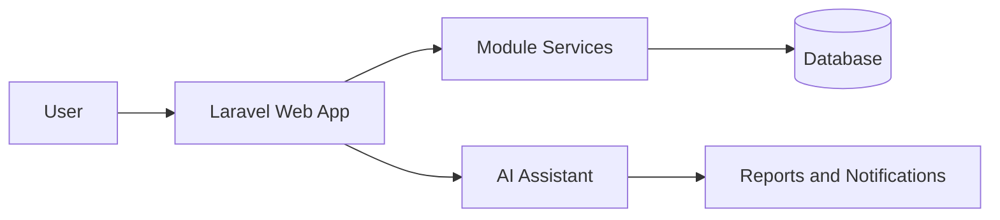

# School ERP


School ERP is a modular Laravel-based school management platform for multi-school operations. The implementation in this repository currently includes authentication, student and teacher management, attendance, exams, homework, fees, payroll, library, transport, HR, notifications, AI assistant workflows, dashboards, and reporting.

## Features

- Multi-school aware tenant context and role-based access control
- Student, teacher, parent, and employee management
- Attendance, homework, exams, fees, payroll, and library workflows
- Transport and document management
- Role-based dashboards and sidebar navigation
- AI assistant and executive-copilot style workflows
- Reporting and notifications

## Architecture Overview



## Installation

```bash
composer install
cp .env.example .env
php artisan key:generate
php artisan migrate
npm install
npm run build
```

## Configuration

- Configure your database connection in .env.
- Set services and AI-related environment variables where required.
- Ensure storage permissions are correct for uploads and generated documents.

## Screenshots

- Login and dashboard screens: placeholder
- Role-based module views: placeholder
- Reports and AI experience: placeholder

## Module Overview

- Authentication
- Students
- Teachers
- Attendance
- Homework
- Exams
- Fees
- Payroll
- Library
- Transport
- HR
- Notifications
- Reports
- AI Assistant
- Settings

## Documentation

The complete documentation set is available in [docs](docs/README.md).

## Roadmap

- Expand automated regression coverage
- Harden reporting and analytics workflows
- Improve deployment and monitoring guidance
- Extend AI assistant support for additional school operations

## Contribution Guide

1. Review the developer guide in [docs/Developer/DEVELOPER_GUIDE.md](docs/Developer/DEVELOPER_GUIDE.md).
2. Make changes in a feature branch.
3. Add or update relevant tests.
4. Update the documentation if behavior changes.

## Support

For implementation, deployment, and operational questions, use the documentation set in [docs](docs/README.md) or review the module-specific guides.

## License

This project is licensed under the MIT License.

## Credits

This project uses Laravel, Spatie Permission, Laravel Sanctum, DataTables, Excel, DomPDF, and related ecosystem packages.
