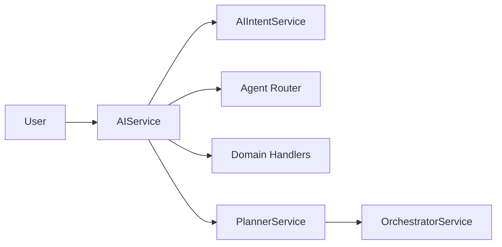
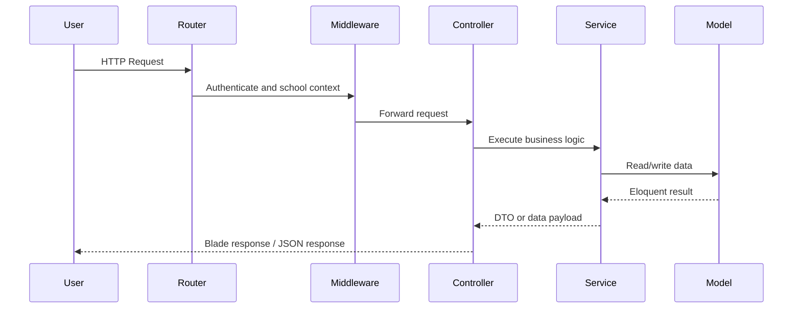

# System Architecture

Version: 1.0.0

Revision date: 2026-07-08

## 1. Purpose

This document describes the current architecture of the School ERP application as implemented in the repository. It covers the application structure, service layers, routing, tenant handling, RBAC, AI integration, and module relationships.

## 2. Project Structure

```text
app/
  Core/                # Shared infrastructure and tenant context
  Http/                # Controllers, middleware, requests
  Models/              # Shared Eloquent models
  Modules/             # Functional modules with controllers/services/policies/repositories
  Providers/           # Service provider registration
  Helpers/             # Shared helper functions
bootstrap/
config/
resources/views/      # Blade templates
routes/               # Web and module route files
database/migrations/  # Schema evolution
tests/                # Automated tests
```

## 3. Layered Architecture

The application follows a layered Laravel architecture:

| Layer | Responsibility | Examples |
| --- | --- | --- |
| Presentation | HTTP entry points, Blade views, route definitions | Controllers, views, routes |
| Application | Orchestration and workflow logic | Services, dashboard builders, AI services |
| Domain | Business rules and module-specific logic | Policies, repositories, models |
| Data | Persistence and migrations | Eloquent models, migrations, seeders |

## 4. Key Architectural Patterns

### Service Layer

Module-specific business logic is implemented in service classes under app/Modules/*/Services. Examples include AttendanceService, FeeService, PayrollService, HomeworkService, TransportService, and AIService.

### Repository Pattern

Repositories exist for several modules such as StudentRepository, TeacherRepository, FeeRepository, AttendanceRepository, PayrollRepository, and TransportRepository. These classes encapsulate data access responsibilities.

### Builder Pattern

Dashboard rendering is implemented through the DashboardFactory and role-specific builders such as AdminDashboardBuilder, TeacherDashboardBuilder, ParentDashboardBuilder, and PrincipalDashboardBuilder.

### Policy Pattern

Module authorization is implemented with policy classes under app/Modules/*/Policies and enforced through Laravel policies and Spatie permissions.

### Middleware

The request pipeline uses middleware for authentication, tenant context, and school resolution, most notably SetSchoolContext.

## 5. Multi-school Architecture

The system is designed for multi-school operation. School context is resolved through:

- Request input or header values
- Session state
- User current_school_id
- Guardian school linkage
- School-user pivot records
- Role assignments with school_id

The SchoolContext singleton and the PermissionRegistrar team ID are updated for each request so role checks and permissions are scoped correctly.

## 6. RBAC and Permissions

Permissions and roles are managed through Spatie Permission. Role-based routes are defined in the module route files and protected with permission middleware.

## 7. AI Architecture

The AI architecture uses a service-oriented pipeline:

- AIIntentService resolves the user intent.
- PromptBuilder builds prompts.
- PlannerService and OrchestratorService handle executive-style requests.
- AIService executes the request using handlers and agent routing.
- AiAgents registry and handlers provide domain-specific execution.



## 8. Dashboard Architecture

Dashboards are built from the DashboardService, DashboardFactory, and role-specific builders. Sidebar navigation is generated through SidebarBuilder and permission-aware item filtering.

## 9. Request Lifecycle



## 10. Module Relationships

| Module | Depends on |
| --- | --- |
| Students | Academics, Parents, Fees, Attendance |
| Teachers | Academics, Attendance, Homework, Exams |
| Attendance | Students, Classes, Sections |
| Fees | Students, Academic years, School context |
| Payroll | HR, Employees, School context |
| Library | Students, Teachers |
| Transport | Students, Routes, Vehicles |
| AI | Notifications, Exams, Fees, Homework, Transport |
| Reports | Attendance, Fees, Exams, Students |

## 11. Dependency Notes

The application relies on Laravel 12, Spatie Permission, Laravel Sanctum, Yajra DataTables, Maatwebsite Excel, DomPDF, Intervention Image, and Spatie Activity Log.
