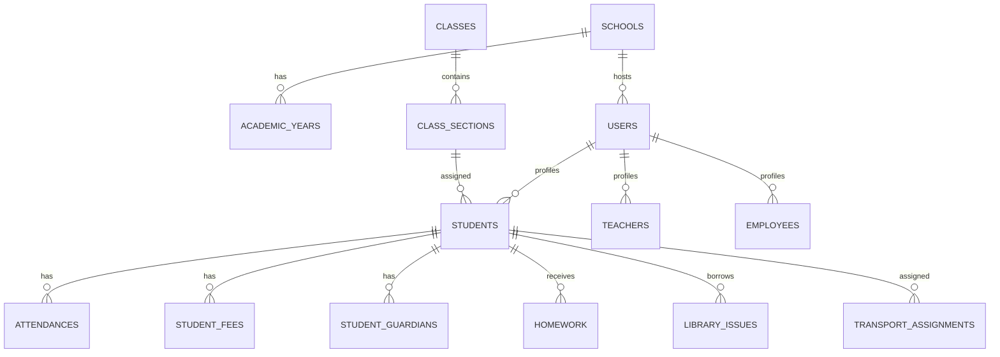

# Database Schema

Version: 1.0.0

Revision date: 2026-07-08

## 1. Overview

The database layer is implemented with Laravel migrations under database/migrations. The project uses a multi-school schema with school-scoped data, soft deletes, audit-friendly columns, and role-based access control tables.

## 2. Entity Relationship Diagram

## 3. Core Tables

| Table | Purpose |
| --- | --- |
| schools | Tenant/school definitions |
| academic_years | Academic years per school |
| users | Core user accounts |
| school_user | School membership for users |
| classes | School classes |
| sections | Sections within classes |
| class_section | Class-section mapping |
| subjects | Academic subjects |
| students | Student profiles |
| student_guardians | Guardian/student links |
| attendances | Student attendance records |
| fee_categories | Fee category definitions |
| fee_structures | Fee structures |
| student_fees | Fee assignments per student |
| fee_payments | Fee receipt/payment records |
| teachers | Teacher profiles |
| exams | Exam definitions |
| exam_schedules | Scheduled exams |
| exam_marks | Student marks |
| homework | Homework assignments |
| leave_requests | Leave requests |
| notifications | Notification payloads |
| library books and issues tables | Library module |
| payroll tables | Payroll runs and payslips |
| transport tables | Vehicles, drivers, routes, assignments |
| hr tables | HR employee and document tables |

## 4. Multi-school Columns and Context

The schema uses school-scoped data via school_id in many module tables and via the school_user relationship table. Tenant context is resolved at runtime by the school middleware and SchoolContext service.

## 5. Soft Deletes and Audit Fields

- Schools and users support soft deletes.
- Activity logging is supported through the activity log tables.
- The application also records login activity and AI query logs.

## 6. Key Relationships

| Parent | Child | Relationship |
| --- | --- | --- |
| schools | academic_years | one-to-many |
| schools | users (via school_user) | many-to-many |
| classes | class_section | one-to-many |
| class_section | students | one-to-many |
| students | attendances | one-to-many |
| students | student_fees | one-to-many |
| students | homework | one-to-many |

## 7. Indexing and Constraints

The project includes migrations for performance indexes and school-scoped search indexes. Database constraints are defined in the migrations and should be reviewed in the relevant migration files for exact implementation details.

## 8. Migration Order

The current migration set progresses from foundational tenant and user tables toward academic, attendance, fee, teacher, exam, homework, leave, transport, library, payroll, AI, and HR tables.

## 9. Data Flow Summary

1. School and user records are created.
2. Role assignments and school memberships are established.
3. Academic structures such as classes, sections, and subjects are configured.
4. Student and teacher records are added.
5. Attendance, fees, and assessments are recorded.
6. Reports and AI workflows consume the resulting data.
